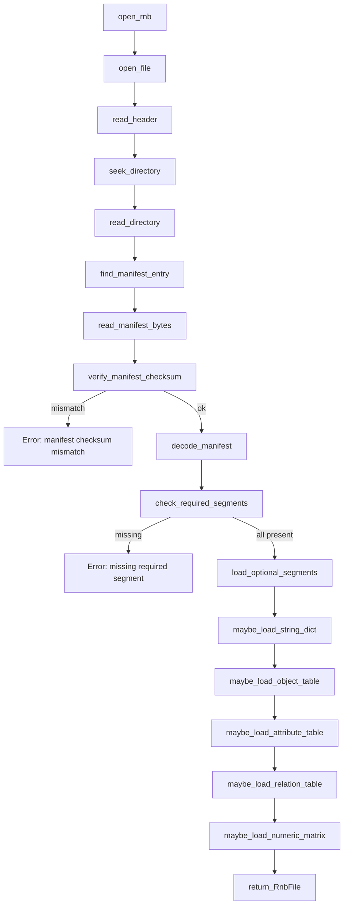

# `open_rnb` flow

This diagram documents the control flow and validation logic inside `rnb_format::open_rnb`, which reconstructs an `RnbFile` from a `.rnb` artifact on disk.

```mermaid
graph TD
    A[open_rnb] --> B[open_file]
    B --> C[read_header]
    C --> D[seek_directory]
    D --> E[read_directory]

    E --> F[find_manifest_entry]
    F --> G[read_manifest_bytes]
    G --> H[verify_manifest_checksum]

    H -->|mismatch| X[Error: manifest checksum mismatch]
    H -->|ok| I[decode_manifest]

    I --> J[check_required_segments]
    J -->|missing| Y[Error: missing required segment]
    J -->|all present| K[load_optional_segments]

    K --> S[maybe_load_string_dict]
    S --> O[maybe_load_object_table]
    O --> AT[maybe_load_attribute_table]
    AT --> RT[maybe_load_relation_table]
    RT --> NM[maybe_load_numeric_matrix]

    NM --> R[return_RnbFile]
```
