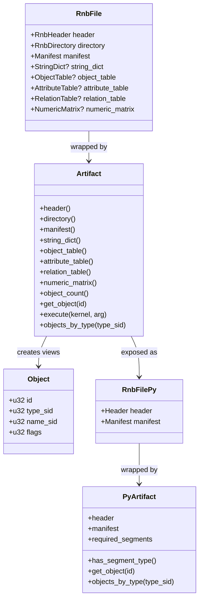

# Rinnovo Architecture

This diagram shows how the core RNB format, runtime engine, and Python layers relate to each other.

```mermaid
classDiagram
    class RnbFile {
      +RnbHeader header
      +RnbDirectory directory
      +Manifest manifest
      +StringDict? string_dict
      +ObjectTable? object_table
      +AttributeTable? attribute_table
      +RelationTable? relation_table
      +NumericMatrix? numeric_matrix
    }

    class Artifact {
      +header()
      +directory()
      +manifest()
      +string_dict()
      +object_table()
      +attribute_table()
      +relation_table()
      +numeric_matrix()
      +object_count()
      +get_object(id)
      +execute(kernel, arg)
      +objects_by_type(type_sid)
    }

    class Object {
      +u32 id
      +u32 type_sid
      +u32 name_sid
      +u32 flags
    }

    class RnbFilePy {
      +Header header
      +Manifest manifest
    }

    class PyArtifact {
      +header
      +manifest
      +required_segments
      +has_segment_type()
      +get_object(id)
      +objects_by_type(type_sid)
    }

    RnbFile --> Artifact : wrapped by
    Artifact --> Object : creates views
    Artifact --> RnbFilePy : exposed as
    RnbFilePy --> PyArtifact : wrapped by
```

