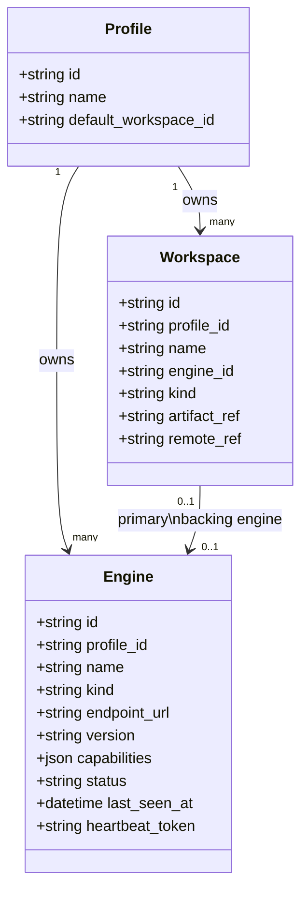

# Rinnovo Registrar Data Model (v0.1)

This document describes the current relational data model used by the
registrar service. It is intentionally small and focused on the control
plane: users/profiles, workspaces, and engines. The registrar does **not**
store virtual layer data or matrices; those live in `.rnb` artifacts and
engine-local storage.

## Overview

The registrar currently persists three core entities:

- `Profile` – a logical grouping of workspaces and engines.
- `Workspace` – a user-visible workspace, backed by a local or remote
  engine and (optionally) an artifact.
- `Engine` – a running or known engine instance that exposes the virtual
  layer HTTP API.

There is no `User` table yet; the default profile is `prof_default`.

## Entity definitions

### Profile

SQLAlchemy model: `python.registrar.app.Profile`

- `id: str` – primary key, for now `prof_default`.
- `name: str` – display name, e.g. `"Default"`.
- `default_workspace_id: str | None` – workspace id to use by default.

Relationships:

- `workspaces: List[Workspace]` – workspaces owned by this profile.
- `engines: List[Engine]` – engines registered under this profile.

### Workspace

SQLAlchemy model: `python.registrar.app.Workspace`

- `id: str` – primary key, e.g. `"ws_default"`.
- `profile_id: str` – foreign key to `Profile.id`.
- `name: str` – display name, e.g. `"Local Workspace"`.
- `engine_id: str | None` – optional foreign key to `Engine.id`
  indicating the primary engine backing this workspace.
- `kind: str` – `"local_engine"` or `"remote_managed"` (for now
  `"local_engine"` by default).
- `artifact_ref: str | None` – optional locator for the backing
  artifact, e.g. a file path or URI.
- `remote_ref: str | None` – optional reference for remotely managed
  workspaces (e.g. a cloud workspace id).

Relationships:

- `profile: Profile` – owning profile.

### Engine

SQLAlchemy model: `python.registrar.app.Engine`

- `id: str` – primary key, e.g. `"eng_<timestamp>"`.
- `profile_id: str` – foreign key to `Profile.id`.
- `name: str` – human-friendly label, e.g. `"local-dev"`.
- `kind: str` – `"local"`, `"remote"`, or `"managed"`.
- `endpoint_url: str` – base URL where the engine HTTP API is reachable.
- `version: str` – engine version string, e.g. `"0.1.0"`.
- `capabilities: JSON` – JSON array of capability strings, e.g.
  `["rnb:v1", "http:v1"]`.
- `status: str` – `"online"`, `"offline"`, or `"unknown"`.
- `last_seen_at: datetime` – last heartbeat timestamp (UTC).
- `heartbeat_token: str` – secret token required for heartbeats from
  this engine.

Relationships:

- `profile: Profile` – owning profile.

## Default rows

On startup and on first use, the registrar ensures that:

- A default `Profile` exists:
  - `id = "prof_default"`
  - `name = "Default"`
  - `default_workspace_id = "ws_default"`
- A default `Workspace` exists:
  - `id = "ws_default"`
  - `profile_id = "prof_default"`
  - `name = "Local Workspace"`
  - `engine_id = None`
  - `kind = "local_engine"`

New `Engine` rows are created via `POST /v1/engines/register` and
updated via `POST /v1/engines/{engine_id}/heartbeat`.

## Notes and future extensions

- A `User` table is not yet present. In the future, `Profile` is likely
  to be associated with `User` via a `user_id` foreign key.
- `Workspace` currently refers to a single `engine_id`. If a workspace
  needs to be moved between engines or replicated, additional metadata
  or join tables may be introduced.
- Virtual views (e.g. "log1p", "PCA", "UMAP") are not yet modeled.
  When added, they will reference `Workspace.id` and contain a small
  JSON spec rather than storing matrices in Postgres.
